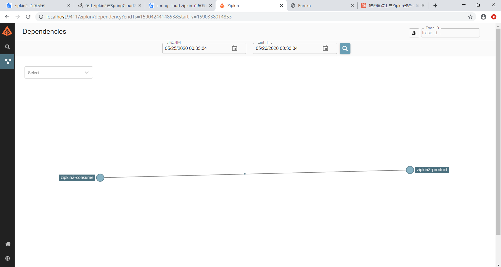

spring-boot高版本不支持集成zipkin-server，此处单独运行jar文件

java -jar zipkin-server.jar --zipkin.collector.rabbitmq.addresses=10.10.10.10:5672 --zipkin.collector.rabbitmq.username=zhxl --zipkin.collector.rabbitmq.password=zhxl

jar启动指定server端口
--server.port=8080

启动zipkin-server
访问地址http://localhost:9411/zipkin/

启动服务提供者

启动消费者

使用postman发送post请求到服务消费者，得到调用结果
查看zipkinn网页效果
截图图下
