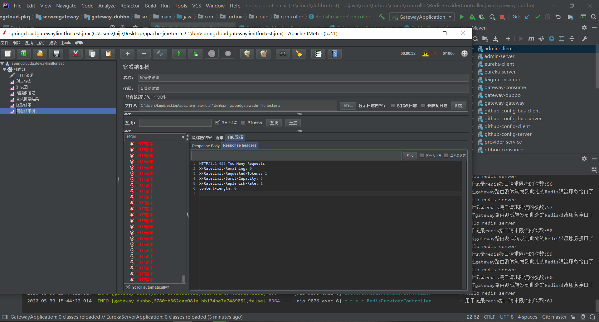

server:
  port: 9527

eureka:
  instance:
    healthCheckUrlPath: ${server.servlet.context-path}/actuator/health
    statusPageUrlPath: ${server.servlet.context-path}/actuator/info
    homePageUrl: ${server.servlet.context-path}/
    healthcheck:
      enabled: true
    hostname: 127.0.0.1
    prefer-ip-address: true
  client:
    service-url:
      defaultZone: http://${spring.security.user.name}:${spring.security.user.password}@${eureka.instance.hostname}:8001/eureka/
    enabled: true
spring:
  security:
    user:
      name: admin
      password: 123456
  zipkin:
    base-url: http://127.0.0.1:9411
    sleuth:
      sampler:
        percentage: 1.0
  cloud:
    gateway:
      #开启spring cloud gateway的路由功能
      enabled:  true
      loadbalancer:
        #负载均衡使用404
        use404: true
      #开启服务发现
      discovery:
        locator:
          enabled: true
          lower_case_service_id: true
          #开启基于注册中心的路由表。gateway可以通过开启以下配置来打开根据服务的serviceId来匹配路由,默认是大写:
          #如果需要小写serviceId,则配置
      routes:
        #访问地址
        #http://localhost:9871/baidu
        - id: baidu
          uri: https://www.baidu.com
          predicates:
            - Path=/baidu

        - id: neo_route
          uri: http://www.ityouknow.com
          predicates:
            - Path=/spring-cloud

        #路由到注册中心的微服务模块
        #访问地址http://localhost:9871/api/gateway/route,当设置StripPrefix: 1时，默认过滤掉/api
        #则实际地址访问就变成了http://localhost:9871/api/gateway/route
        - id: gateway-consume
          uri: lb://gateway-consume
          predicates:
            - Path=/api/**
          filters:
            - StripPrefix=1
            # 熔断降级配置
            - name: Hystrix
              args:
                name: default
                fallbackUri: 'forward:/fallback'

        - id: liebe
          uri: http://localhost:9875/gateway/route
          predicates:
            - Path=/liebe
          #请求重试
          filters:
            #- StripPrefix: 1
            - name: Retry
              args:
                retries: 3
                statuses: BAD_GATEWAY
            #最大请求数量
            - name: RequestSize
              args:
                maxSize: 5000000

 #熔断器配置
hystrix:
  command:
    default:
      execution:
        isolation:
          strategy: SEMAPHORE
          thread:
            timeoutInMilliseconds: 3000
  shareSecurityContext: true

management:
  endpoints:
    web:
      exposure:
        include: "*"
jemeter高并发测试
10次每秒1000次请求，发现后端接收实际请求没有那么多，证明限流起作用了

