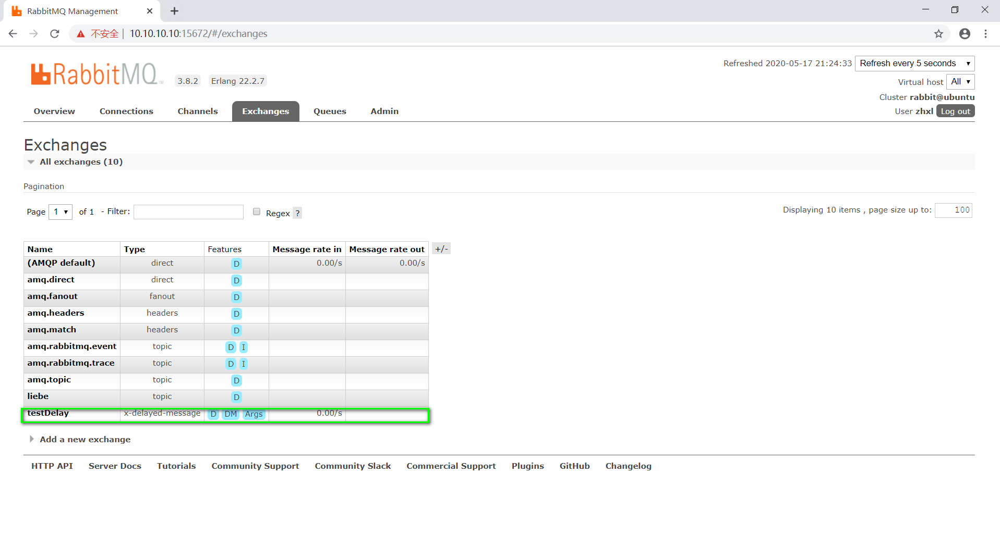

关于rabbitmq实现的延迟队列问题
默认生成的Exchange类型是topic
RabbitMQ中有4中交换机，分别是

（FANOUT）扇形交换机:

扇形交换机是最基本的交换机类型，它所能做的事情非常简单———广播消息。扇形交换机会把能接收到的消息全部发送给绑定在自己身上的队列。因为广播不需要“思考”，所以扇形交换机处理消息的速度也是所有的交换机类型里面最快的。

（DIRECT）直连交换机

直连交换机是一种带路由功能的交换机，一个队列会和一个交换机绑定，除此之外再绑定一个routing_key，当消息被发送的时候，需要指定一个binding_key，这个消息被送达交换机的时候，就会被这个交换机送到指定的队列里面去。同样的一个binding_key也是支持应用到多个队列中的。

这样当一个交换机绑定多个队列，就会被送到对应的队列去处理。对应的工作模式就是Routing,路由模式

适用场景：有优先级的任务，根据任务的优先级把消息发送到对应的队列，这样可以指派更多的资源去处理高优先级的队列。

（TOPIC） 主题交换机，也叫通配符交换机

直连交换机的routing_key方案非常简单，如果我们希望一条消息发送给多个队列，那么这个交换机需要绑定上非常多的routing_key，假设每个交换机上都绑定一堆的routing_key连接到各个队列上。那么消息的管理就会异常地困难。

所以RabbitMQ提供了一种主题交换机，发送到主题交换机上的消息需要携带指定规则的routing_key，主题交换机会根据这个规则将数据发送到对应的(多个)队列上。

主题交换机的routing_key需要有一定的规则，交换机和队列的binding_key需要采用*.#.*.....的格式，每个部分用.分开，其中：

*表示一个单词
#表示任意数量（零个或多个）单词。
假设有一条消息的routing_key为fast.rabbit.white,那么带有这样binding_key的几个队列都会接收这条消息：

fast.*.*
*.*.white
fast.#
（HEADER）首部交换机

​ 首部交换机是忽略routing_key的一种路由方式。路由器和交换机路由的规则是通过Headers信息来交换的，这个有点像HTTP的Headers。将一个交换机声明成首部交换机，绑定一个队列的时候，定义一个Hash的数据结构，消息发送的时候，会携带一组hash数据结构的信息，当Hash的内容匹配上的时候，消息就会被写入队列。

​ 绑定交换机和队列的时候，Hash结构中要求携带一个键**“x-match”，这个键的Value可以是any或者all，这代表消息携带的Hash是需要全部匹配**(all)，还是仅匹配一个键(any)就可以了。相比直连交换机，首部交换机的优势是匹配的规则不被限定为字符串(string)。

